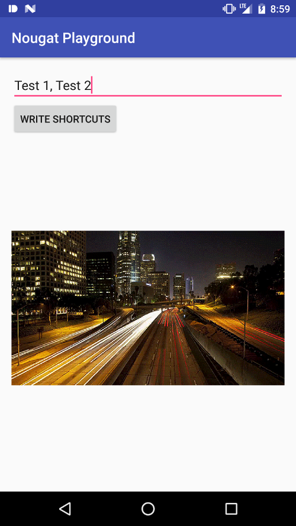
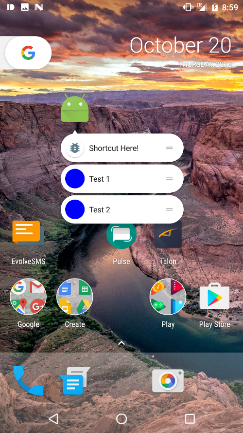

# Nougat Playground

 

Just a demo of some of the Nougat features:

- Dynamic and Static Launcher Shortcuts
- Round Icon
- Image Keyboard

## Round Icon

This one is easy enough to add, just add the icon to your `res` folder, then add it to your `AndroidManifest.xml`:

```
<application
        tools:ignore="ManifestResource"
        android:allowBackup="true"
        android:icon="@mipmap/ic_launcher"
        android:roundIcon="@mipmap/ic_launcher_round"
        android:label="@string/app_name"
        android:supportsRtl="true"
        android:theme="@style/AppTheme">

...
```

## Static Launcher Shortcuts

Fist add the following in the `AndroidManifest.xml`. It should be a child of your launcher activity:

```
<meta-data
       android:name="android.app.shortcuts"
       android:resource="@xml/shortcuts"/>
```

See the [AndroidManifest.xml](/app/src/main/AndroidManifest.xml) for the full example.

After adding that, create a `shortcuts.xml` file within your `/res/xml/` directory.

This can be a starting point, but you will need to customize it for your own app, icons, and intents.

```
<?xml version="1.0" encoding="utf-8"?>
<shortcuts xmlns:tools="http://schemas.android.com/tools"
    xmlns:android="http://schemas.android.com/apk/res/android">

    <shortcut
        android:icon="@drawable/ic_shortcut"
        android:enabled="true"
        android:shortcutId="static-shortcut-1"
        android:shortcutShortLabel="@string/static_shortcut_message"
        android:shortcutLongLabel="@string/static_shortcut_message"
        tools:targetApi="n_mr1">

        <intent
            android:targetPackage="xyz.klinker.nougatplayground"
            android:action="android.intent.action.VIEW"
            android:targetClass="xyz.klinker.nougatplayground.MainActivity"
            android:data="http://example.com/some_data_uri" />

        <!-- seems like the conversation category is the only one at this point? -->
        <categories android:name="android.shortcut.conversation" />

    </shortcut>

</shortcuts>
```

## Dynamic Launcher Shortcuts

Google introduced a new [ShortcutManager](https://developer.android.com/reference/android/content/pm/ShortcutManager.html) API for this.

Specifically calling `ShortcutManager#setDynamicShortcuts` or `ShortcutManager#addDynamicShortcuts` with `List<ShortcutInfo`.

My example of this can be found in the [DynamicShortcutHelper](/app/src/main/java/xyz/klinker/nougatplayground/DynamicShortcutHelper.java).

It does seem to take just a few seconds for the launcher to catch the updated changes, which should probably be expected.

## Image Keyboard

For this implementation, we have to use a custom `ImageKeyboardEditText` that will grab the `InputConnection` and wrap it up in a callback. Here is the [ImageKeyboardEditText](/app/src/main/java/xyz/klinker/nougatplayground/ImageKeyboardEditText.java).

The implementation is applied in the [MainActivity](/app/src/main/java/xyz/klinker/nougatplayground/MainActivity.java).
